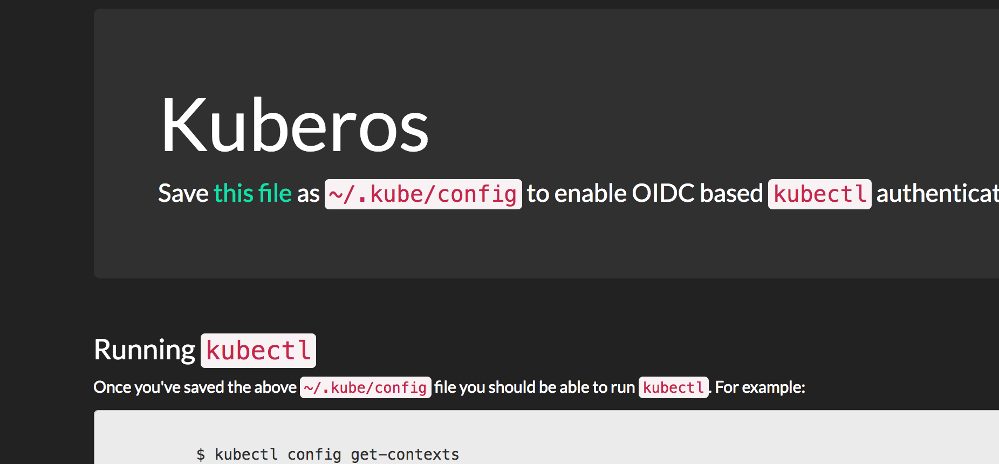

# kuberos
An OIDC authentication helper for Kubernetes' `kubectl`.

## Purpose
Kubernetes supports several authentication methods, a popular one of which is OIDC.
The `kubectl` commandline tool can be configured to use OIDC authentication, including
automatically refreshing its token on invocation. In order to enable this
functionality `kubectl` must be configured with the following parameters:
* A client ID
* A client secret
* An issuer URL
* An ID token
* A refresh token

The latter two of these parameters must be aquired by performing an initial OIDC
authentication outside of `kubectl`. OIDC is an awkward authentication method for a
commandline tool as it is entirely browser based. Existing implementations (see
Alternatives) provide CLI tools to handle this initial authentication. These CLIs will
typically require the user connect to localhost in their Browser to perform the initial
authentication.

Kuberos is designed to instead run as a hosted service. It authenticates users against
an OIDC provider, returning a JSON payload of the parameters required by
`kubectl`. Kuberos provides a simple frontend that links to a `~/.kube/config` file
generated from a supplied template of clusters. It also details how to manually add a
user and context to a cluster, and how to use kubectl.

## Alternatives
* https://github.com/micahhausler/k8s-oidc-helper
* https://github.com/coreos/dex/tree/master/cmd/example-app
