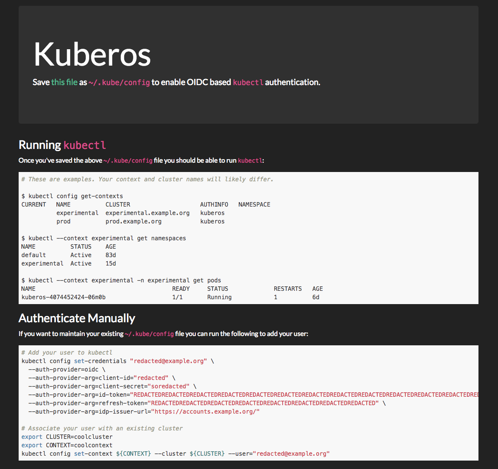

# kuberos [](https://hub.docker.com/r/negz/kuberos/) [](https://godoc.org/github.com/negz/kuberos) [](https://travis-ci.org/negz/kuberos/) [](https://codecov.io/gh/negz/kuberos/)
An OIDC authentication helper for Kubernetes' `kubectl`.



## Status
This project is **effectively unmaintained**. I have not used OIDC authentication for some
time, instead having switched to using [Kubehook](https://github.com/negz/kubehook).
I will do my best to shepherd pull requests, but cannot guarantee a prompt response
and do not have bandwidth to address issues or add new features. Please let me know
via an issue if you'd be interested in taking ownership of Kuberos.

## Purpose
Kubernetes supports several authentication methods, a popular one of which is OIDC.
The `kubectl` commandline tool can be configured to use OIDC authentication, including
automatically refreshing its token on invocation. In order to enable this
functionality `kubectl` must be configured with the following parameters:
* A client ID
* A client secret
* An issuer URL
* An ID token
* A refresh token

The latter two of these parameters must be aquired by performing an initial OIDC
authentication outside of `kubectl`. OIDC is an awkward authentication method for a
commandline tool as it is entirely browser based. Existing implementations (see
Alternatives) provide CLI tools to handle this initial authentication. These CLIs will
typically require the user connect to localhost in their Browser to perform the initial
authentication.

Kuberos is designed to instead run as a hosted service. It authenticates users against
an OIDC provider, returning a JSON payload of the parameters required by
`kubectl`. Kuberos provides a simple frontend that links to a `~/.kube/config` file
generated from a supplied template of clusters. It also details how to manually add a
user and context to a cluster, and how to use kubectl.

## Usage
Before using Kuberos you must
[enable OIDC at the Kubernetes API server](https://kubernetes.io/docs/admin/authentication/#openid-connect-tokens).
Refer to [this guide](https://cloud.google.com/community/tutorials/kubernetes-auth-openid-rbac)
for details on how to get an OIDC client ID and secret from Google.

Kuberos is [published](https://hub.docker.com/r/negz/kuberos) to the Docker Hub.
It must be configured with an OIDC issuer, client ID, and secret, as well as a
partial `kubeconfig` file. For example:

```bash
export OIDC_CLIENT_ID=woo
export OIDC_CLIENT_SECRET=supersecret

echo $OIDC_CLIENT_SECRET >/tmp/cfg/secret
cat <<EOF >/tmp/cfg/template
apiVersion: v1
kind: Config
current-context: kuberos  # Optional - must be the name of one of the template's clusters.
clusters:
- name: kuberos
  cluster:
    certificate-authority-data: REDACTED
    server: https://kuberos.example.org
EOF

docker run -d -p 10003:10003 -v /tmp/cfg:/cfg "negz/kuberos:latest" \
  /kuberos https://accounts.google.com $OIDC_CLIENT_ID /cfg/secret /cfg/template
```

Kuberos supports the following arguments:
```bash
$ docker run negz/kuberos:latest /kuberos --help
usage: kuberos [<flags>] [<oidc-issuer-url>] [<client-id>] [<client-secret-file>] [<kubecfg-template>]

Provides OIDC authentication configuration for kubectl.

Flags:
      --help                   Show context-sensitive help (also try --help-long
                               and --help-man).
      --listen=":10003"        Address at which to expose HTTP webhook.
  -d, --debug                  Run with debug logging.
      --scopes=profile... ...  List of additional scopes to provide in token.
      --email-domain=EMAIL-DOMAIN
                               The eamil domain to restrict access to.
      --shutdown-grace-period=1m
                               Wait this long for sessions to end before
                               shutting down.
      --shutdown-endpoint=SHUTDOWN-ENDPOINT
                               Insecure HTTP endpoint path (e.g., /quitquitquit)
                               that responds to a GET to shut down kuberos.

Args:
  [<oidc-issuer-url>]     OpenID Connect issuer URL.
  [<client-id>]           OAuth2 client ID.
  [<client-secret-file>]  File containing OAuth2 client secret.
  [<kubecfg-template>]    A kubecfg file containing clusters to populate with a user and contexts.
```

The partial `kubeconfig` template should contain only cluster entries and
optionally a current (i.e. default) context, which must be the name of one of
the clusters. For example:

```yaml
apiVersion: v1
kind: Config
current-context: staging
clusters:
- name: production
  cluster:
    certificate-authority-data: REDACTED
    server: https://prod.example.org
- name: staging
  cluster:
    certificate-authority-data: REDACTED
    server: https://staging.example.org
```

Given the above template Kuberos will generate a `kubeconfig` file containing
the two supplied clusters, the authenticated OIDC user, and a context for each
cluster associating them with the OIDC user. These contexts inherit the name of
the clusters, thus a user could interact with the production cluster by running:
```bash
kubectl --context production cluster-info
```

If the `current-context` is set to the name of one of the clusters then the
`--context` argument may be omitted, and the cluster named by `current-context`
will be used.

## Deploying to Kubernetes
Kuberos can be run inside a cluster as long as it can still communicate with
your OIDC provider from inside the pod and your OIDC provider is set to
redirect to your Kuberos endpoint (NodePort, LoadBalancer, etc).

The configuration below is meant to serve as a template and **not** something
that is plug-and-play. You will need to adjust your DNS / nameserver helpers,
Dex information, and optionally how you ingress your traffic.

```yaml
apiVersion: extensions/v1beta1
kind: Deployment
metadata:
  labels:
    app: kuberos
  name: kuberos
spec:
  replicas: 1
  template:
    metadata:
      labels:
        app: kuberos
    spec:
      # hostAliases are optional, to help route traffic to Dex / OIDC
      hostAliases:
      - ip: "192.168.1.1"
        hostnames:
        - "dex.oidc.example.com"
      containers:
      - image: negz/kuberos:latest
        name: kuberos
        command: ["/kuberos", "https://dex.oidc.example.com", "example-app", "/cfg/secret", "/cfg/template"]
        ports:
        - name: http
          containerPort: 10003
        volumeMounts:
        - name: config
          mountPath: /cfg
      volumes:
      - name: config
        configMap:
          name: kuberos
          items:
          - key: template
            path: template
          - key: secret
            path: secret
---
kind: ConfigMap
apiVersion: v1
metadata:
  name: kuberos
data:
  template: |
    apiVersion: v1
    kind: Config
    current-context: staging
    clusters:
    - name: production
      cluster:
        certificate-authority-data: REDACTED
        server: https://prod.example.org
    - name: staging
      cluster:
        certificate-authority-data: REDACTED
        server: https://staging.example.org
  secret: REDACTED
```

## Alternatives
OIDC/LDAP/static helper specifically for `dex` (Helm charts for dex+helper included)
* https://github.com/mintel/dex-k8s-authenticator

OIDC helpers that run locally to setup `kubectl`:
* https://github.com/micahhausler/k8s-oidc-helper
* https://github.com/coreos/dex/tree/master/cmd/example-app

A Kubernetes JWT webhook helper with a similar UX to Kuberos
* https://github.com/negz/kubehook

## Contributors
[Nic Cope](https://github.com/negz) - Creator

[Rajat Sharma](https://github.com/Sharma-Rajat) - Frontend

[Maxime Guyot](https://github.com/Miouge1)

[Ripta Pasay](https://github.com/ripta)

[John Delivuk](https://github.com/john-delivuk)

[Aaron Roydhouse](https://github.com/whereisaaron)

[keattang](https://github.com/keattang)

[jimangel](https://github.com/jimangel)

[arnoldbechtoldt](https://github.com/arnoldbechtoldt)
